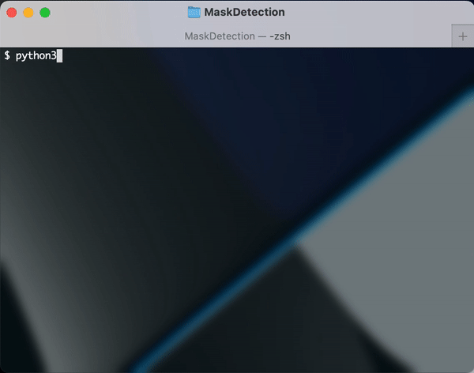
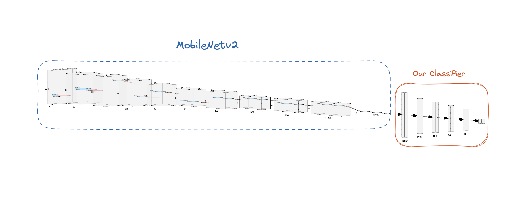
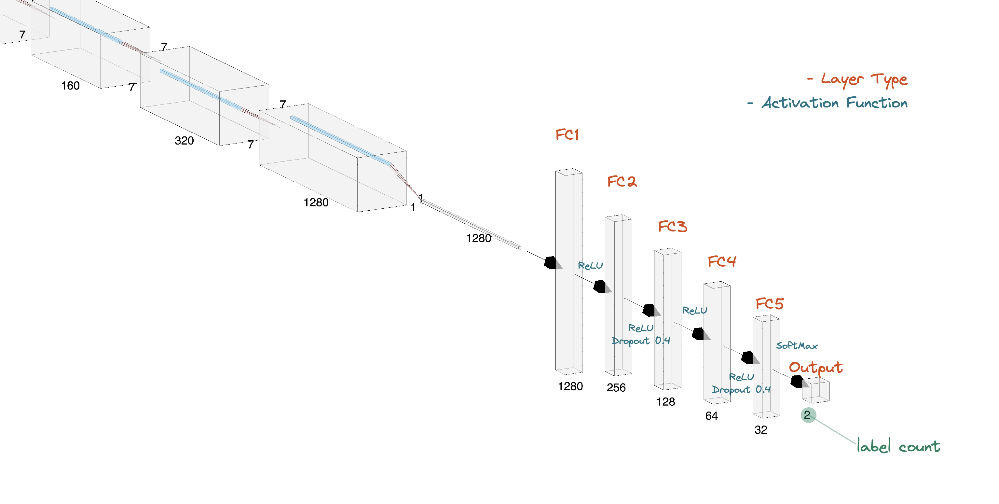

# AI Term Project

<h5 align="center">
Deep Learning - Face Mask Detection
</h5>

## :gear: Installation

1. Clone the repository

   ```bash
   $ git clone https://github.com/samuel032khoury/AITermProject.git
   ```

2. Install dependencies

   ```bash
   $ pip3 install -r requirements.txt
   ```

## :card_file_box: Data Collection

As this program is performing a supervised learning, it needs labeled data for training & testing. The data set directory needs to be under the root of the project, and has an inner structure of:

```
./
├── dataset
│   ├── train                  # training data
│       ├── [Label 1]
│       ├── [Label 2]
│       └── ...
│   └── test                   # testing data
│       ├── [Label 1]
│       ├── [Label 2]
└──     └── ...
```

Notice labels don't have to be binary, but they have to match across the training folder and the testing folder.

### Sample Data Source

- `./data`: https://www.kaggle.com/datasets/andrewmvd/face-mask-detection?resource=download&select=images
- `./data_big`: https://github.com/chandrikadeb7/Face-Mask-Detection/tree/master/dataset

## :joystick: Usage

### Model Training

```bash
$ python3 trainModel.py
```



- CLI inputs:
  1. Data location (default = `./data`)
  2. Epochs for training (default value depends on the data size)
  3. Name for the trained model

### Model Running

```bash
$ python3 runModel.py
```

- CLI inputs:
  1. Name of the model to use

#### Model Running Demo (Use the model trained by `./data_big`)


## :building_construction: Architecture

The project used *MobileNetv2* pre-trained model for transfer learning (all parameters were freezed). The produced tensor then is taken as the input to train the (modified) classifier of the model in order to make predictions.

### Architecture Overview



### Classifier Structure


## :microscope: Results & Analysis


## :warning: Limitations

- Performance under a low-light environment is suboptimal.

## :scroll: Reference

1. **[Deep Learning Specialization](https://www.coursera.org/specializations/deep-learning) Offered By [DeepLearning.AI](https://www.deeplearning.ai) on [Coursera](https://www.coursera.org/)**: Structual conceptual knowledge for DL.
2. **[Extracting faces using OpenCV Face Detection Neural Network](https://towardsdatascience.com/extracting-faces-using-opencv-face-detection-neural-network-475c5cd0c260)**: Inspiration for extracting faces from image
3. **[Face detection with OpenCV and deep learning](https://medium.com/@vinuvish/face-detection-with-opencv-and-deep-learning-90bff9028fa8)**: Inspiration for `runModel.py`, mostly the OpenCV part.
4. **[PyTorch Official Github Profile](https://github.com/pytorch)**: Reference for PyTorch relavent issue.
5. **[PyTorch Tutorials](https://github.com/pytorch/tutorials)**: Practical material of syntax and semantics of PyTorch; Help get familiar with functions.
6. **[PyTorch Vision](https://github.com/pytorch/vision)**: Officia documentation as a reference for transfer learning
   - **[mobilenetv2](https://pytorch.org/hub/pytorch_vision_mobilenet_v2/)**: The pre-trained model the prjected used
7. **[Face-Mask-Detection](https://github.com/chandrikadeb7/Face-Mask-Detection)**: A similar project as a reference, also as our data set source
